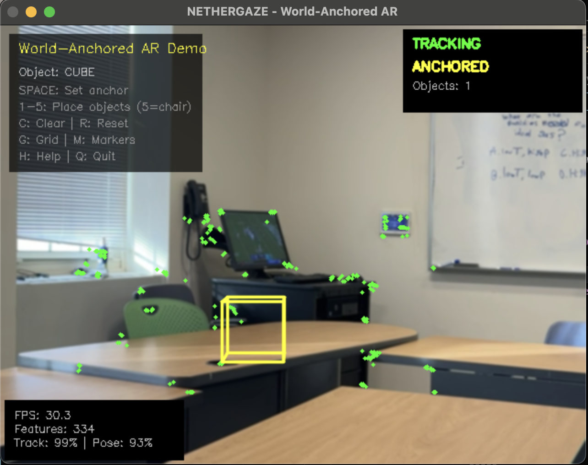

# ComputerVision

**CS366: Computer Vision - Final Project**

## NETHERGAZE

A markerless augmented reality system that places virtual 3D objects in real-world scenes using natural feature tracking.



### Key Features

- **Markerless AR** - No fiducial markers needed, works on any textured surface
- **World-Anchored Objects** - Virtual objects stay fixed in 3D space as the camera moves
- **Real-time Tracking** - ORB feature detection + Lucas-Kanade optical flow
- **Multiple 3D Objects** - Cubes, pyramids, coordinate axes, boxes, and chairs
- **Live Statistics** - FPS, feature count, tracking rate, and pose success rate

### Quick Start

```bash
cd NETHERGAZE
pip install -r requirements.txt
python src/main.py
```

### How to Use

1. Point camera at a textured surface (book, poster, keyboard)
2. Wait for green "TRACKING" indicator
3. Press **SPACE** to set anchor point
4. Press **1-5** to place 3D objects
5. Move camera around - objects stay in place!

### Controls

| Key | Action |
|-----|--------|
| `SPACE` | Set anchor point |
| `1-5` | Place objects (1=cube, 2=pyramid, 3=axes, 4=box, 5=chair) |
| `C` | Clear objects |
| `G` | Toggle grid |
| `M` | Toggle markers |
| `Q` | Quit |

### Technical Stack

- **OpenCV** - Video capture, feature detection, rendering
- **ORB** - Feature detection (Oriented FAST + Rotated BRIEF)
- **Lucas-Kanade** - Optical flow tracking
- **Essential Matrix + RANSAC** - Pose estimation

See [NETHERGAZE/README.md](NETHERGAZE/README.md) for full documentation.

---

**Author:** Milan Savard  
**Course:** CS366 F25
